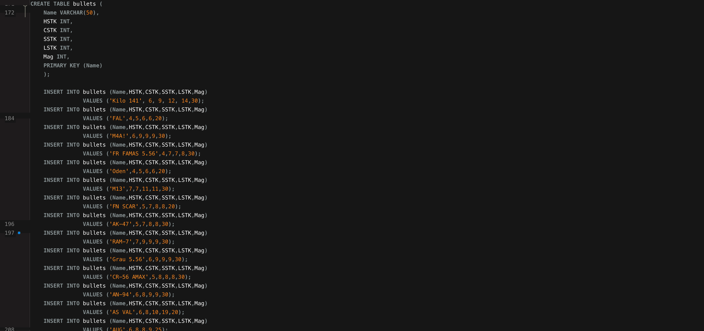
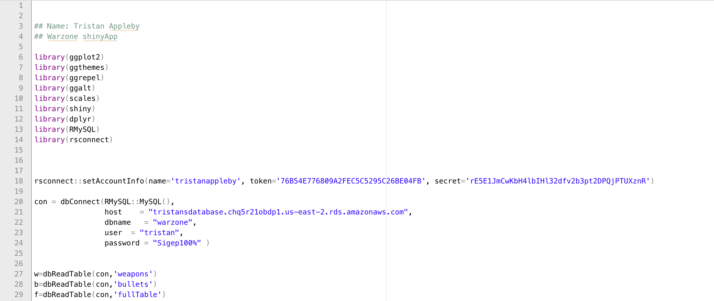

# WARZONE DATABASE

### Project overview
* This project analyzes weapon choices for the video game Call of Duty: Warzone
* I build a database that holds all weapon data
* I connect an R shiny app that displays plots for the data
* The programs used were MySQL and R Studio

### Objectives:
Construct a MySQL database that holds data for weapon statistics. Allow players to visually compare weapons choices and analyse statistics, for different gun classes, that affect overall game performance: time to kill, rounds per minute, magazine Size, shot placement damage.

You can see Data source here **[HERE](https://www.downsights.com/call-of-duty-warzone-weapon-stats/#modern-warfare-2019)**:

### Data preparation
The relevant data for each observation website is taken from the website and hardcoded into a table labelled as 'weapons'. Another table is then created and is labelled as 'bullets'. It holds different information but will still contain the weapon name. This is used to join the the tables and create the 'fullTable'.

From the 'fullTable', there are 6 views and 10 stored procedures that are used to monitor and maintain the database.

You can see SQL query here **[HERE](https://github.com/programTristan/Warzone_Database/blob/95f5745c6a2156d51d821ebc7b78229de790ac70/SQL_Query/TristanApplebywarzone.sql)**:

### Data modelling:
The database is then connected to R studio for data plotting. The ggplot2 library is used to render several graphs that will be displayed on the user interface. 

You can see R code here **[HERE](https://github.com/programTristan/Warzone_Database/blob/95f5745c6a2156d51d821ebc7b78229de790ac70/R_Code/TristanAppleby_warzoneShiny.R)**:

### Visualizations 
The Shiny App consists of 5 different plots and 1 data table.
*

You can see the final dashboard clicking **[HERE](https://tristanappleby.shinyapps.io/Warzone_DB/)** or in the image below

eed more information to understand why
