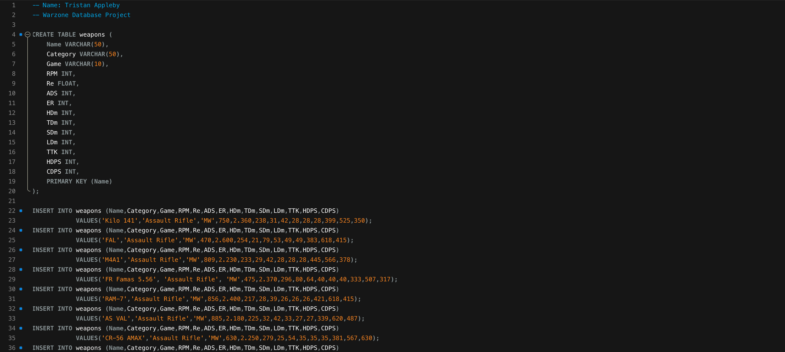
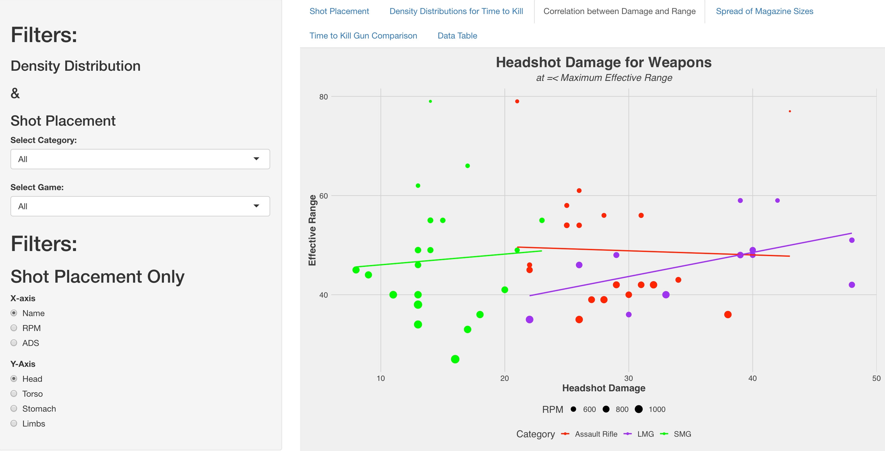

# WARZONE DATABASE

### Project overview
* This project analyzes weapon choices for the video game Call of Duty: Warzone
* I build a database that holds all weapon data
* I connect an R shiny app that displays plots for the data
* The programs used were MySQL and R Studio

### Objectives:
Construct a MySQL database that holds data for weapon statistics. Allow players to visually compare weapons choices and analyse statistics, for different gun classes, that affect overall game performance: time to kill, rounds per minute, magazine Size, shot placement damage.

You can see Data source here **[HERE](https://www.downsights.com/call-of-duty-warzone-weapon-stats/#modern-warfare-2019)**:

### Data preparation
Each observation is hardcoded into the 'weapons' table.

You can see SQL query here **[HERE](https://github.com/programTristan/Warzone_Database/blob/95f5745c6a2156d51d821ebc7b78229de790ac70/SQL_Query/TristanApplebywarzone.sql)**:

### Data model:

You can see R code here **[HERE](https://github.com/programTristan/Warzone_Database/blob/95f5745c6a2156d51d821ebc7b78229de790ac70/R_Code/TristanAppleby_warzoneShiny.R)**:

### Visualizations 
The final product is a 5 plots dashboard. The first is a snapshot of sales performance while other two focus on customers and sale metrics

You can see the final dashboard clicking **[HERE](https://tristanappleby.shinyapps.io/Warzone_DB/)** or in the image below

eed more information to understand why
